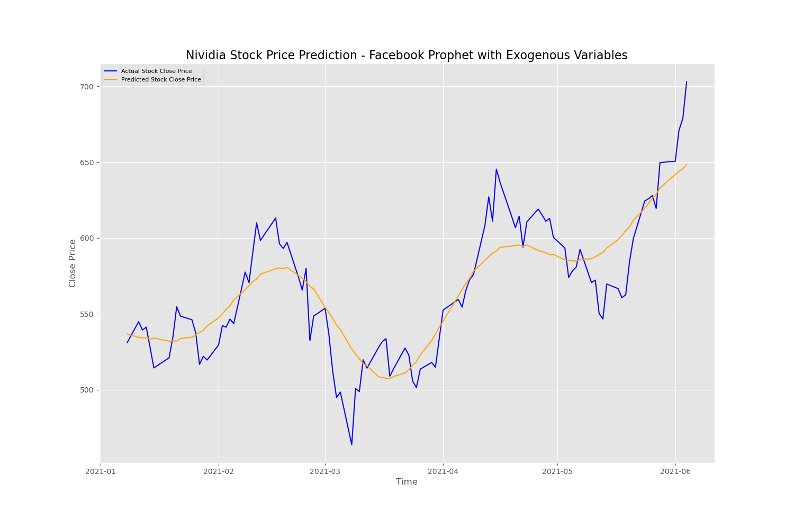
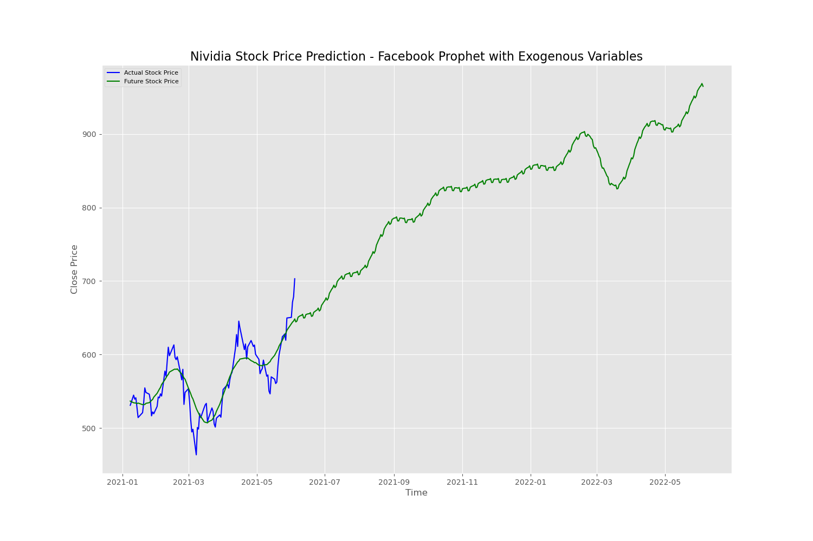

# Nvidia Stock Prediction
<br>
**Author**: [Kibae Kim](mailto:rlqo7376@gmail.com)

Nvidia Corporation, an American multinational technology company designs graphics processing units (GPUs) for the gaming and professional markets, as well as system on a chip units (SoCs) for the mobile computing and automotive market. Its primary GPU line, labeled "GeForce", is in direct competition with the GPUs of the "Radeon" brand by Advanced Micro Devices (AMD)


## Business Problem
The popularity of cryptocurrency caused a shortage in the graphics card market, and it leads increasing of stock price of a graphics card supplier, Nvidia. 
This project aims to provide an updated time series forecasting for investment banks to predict better Nvidia future stock price.


## Overview
The data for the prediction was collected using [Yahoo Finance](https://finance.yahoo.com/) with support of pandas, numpy, and datetime library of Python. [Nvidia closing stock price](https://finance.yahoo.com/quote/NVDA/history?p=NVDA) is main dependent variable which predicted in this project, and [AMD previous day closing stock price](https://finance.yahoo.com/quote/AMD?p=AMD&.tsrc=fin-srch), [Bitcoin price](https://finance.yahoo.com/quote/BTC-USD/history/), [Google trend data](https://trends.google.com/trends/explore?q=nvidia&geo=US), [graphics card market share from Statista](https://www.statista.com/statistics/274005/market-share-of-global-graphics-card-shipments-since-3rd-quarter-2010/), and [Nvidia Earnings Date, Estimates & History from Market Beat](https://www.marketbeat.com/stocks/NASDAQ/NVDA/earnings/) were chosen for exogenous variables. For time series forecasting model, ARIMA, ARIMA with exogenous variables, LSTM, and Prophet were tested on daily closing price of Nvidia.


## Method
1. Nvidia's historical stock data was collected from Yahoo Finance between 1/22/1999 and 6/4/2021
2. Relationships between stock closing price and exogenous variables
3. ARIMA order for Nvidia's daily closing price were calculated
    - Auto ARIMA
4. ARIMA, ARIMA with exogenous variables built and tested
5. LSTM built and tested
6. Prophet built and tested


## Data

### Nvidia Stock Price
<br>

#### Between 09/16/2018 and 06/01/2019
Concerns about rising interest rates, a slowing global economy and particularly slowing demand for semiconductors and the escalating trade war with China were likely the main reasons for the market jitters. NVIDIA stock declined. In addition, Nvidia's release of third-quarter results along with fourth-quarter guidance on 11/15/2018, that disappointed the market. The slope of the graph changed before and after the stock price plunged in this period. After the stock price plunged in this period, The slope of the stock price upward graph increased.

#### Between 02/20/2020 and 04/07/2020
The 2020 stock market crash was a major and sudden global stock market crash that began on 2/20/2020 and ended on 04/07/2020, and Nvidia's stock closing price also decreased in this period. However, the period was short, and the stock immediately recovered the previous share price.


## Model and Result
The model will be built with ARIMA (AutoRegressive Integrated Moving Average) model by using log value of Nvidia's closing stock price and will be tested on predicting from 2021 with Nvidia's closing stock price so far. The strategy is following:

1. Split data for forward propagation testing
    - predict Nvidia's closing stock price from 2021
<br>

2. Create ARIMA model
    - build ARIMA model with Nvidia's closing stock price history
3. Create ARIMA model with exogenous variables
    - build ARIMA model with Nvidia's closing stock price history and exogenous variables
4. Create LSTM model
    - build LSTM model with 5 timesteps.
5. Create Prophet model
    - build Prophet model with yearly, daily seasonality
6. Compare each models performance
    - RMSE
    - %RMSE
    
### Final model - Prophet

To prepare the ARIMA with exogenous variables model for forecasting on our data, I used yearly, daily seasonality feature.

#### Result of Prophet
Overall, LSTM performed with:
 - RMSE: 22.05
 - %RMSE: 0.039
<br>

#### Expected Profit
If you buy and sell a stock at the change points, the expected return is 58% in this period.
- 2021-01-19 - Buy     - Actual Price: 521.01
- 2021-02-17 - Sell    - Actual Price: 596.24 +14.44%
- 2021-03-17 - Buy     - Actual Price: 533.65
- 2021-04-21 - Sell    - Actual Price: 614.42 +15.14%
- 2021-05-06 - Buy     - Actual Price: 580.92
- 2021-06-04 - Current - Actual Price: 703.13 +21.04%

#### Future Prediction
Nvidia stock closing price will be around $965 in 1 year.
<br>


## Conclusion
Trading year 2020 had market movements, especially with COVID-19 crash but fortunately, its effect on Nvidia stock closing price was low and Nvidia recovered its stock closing price quickly. During test dataset period, expected profit from trading at the change points is 58% and expected stock price on 6/4/2022 is $965.Overall, the prediction made in this project yielded good insights to market trend using Prophet with exogenous variables to predict Nvidia future stock closing price. The project will help investment banks to predict Nvidia's future stock prices.
However, there will be overfitting since I used yearly and daily seasonality feature.


## Future Work
1. How to overcome overfitting which is caused by seasonality
2. Find other exogenous variables


## Repository Structure

```
├──  data                                            # All the CSV files used for the notebook.
├── images                                           # All visualization and images of the project
├── Nvidia_Stock_Prediction.ipynb                    # Noteboooks used to build the project
├── COVID19_Detection_project_presentation.pdf       # PDF version of project presentation
├── README.md                                        # Top-level README
```
