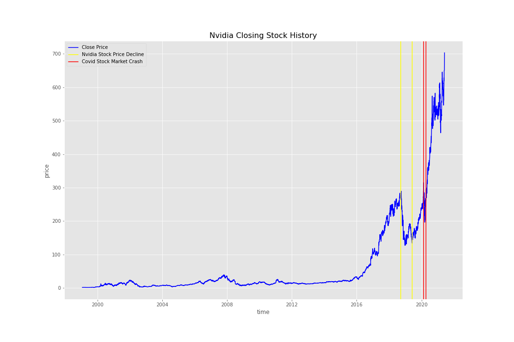
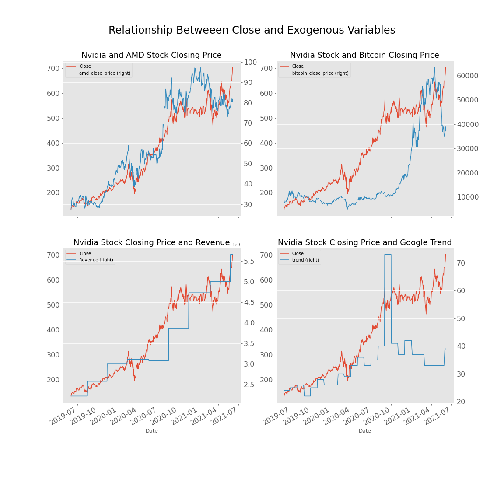
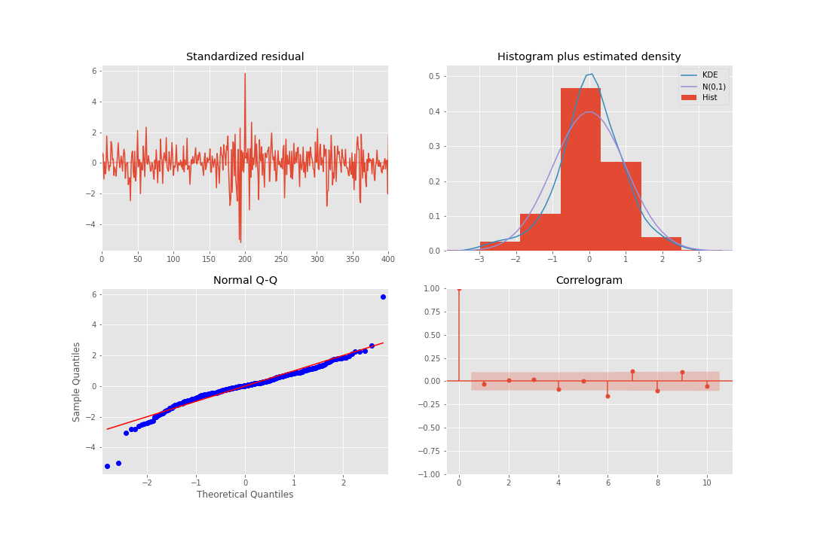
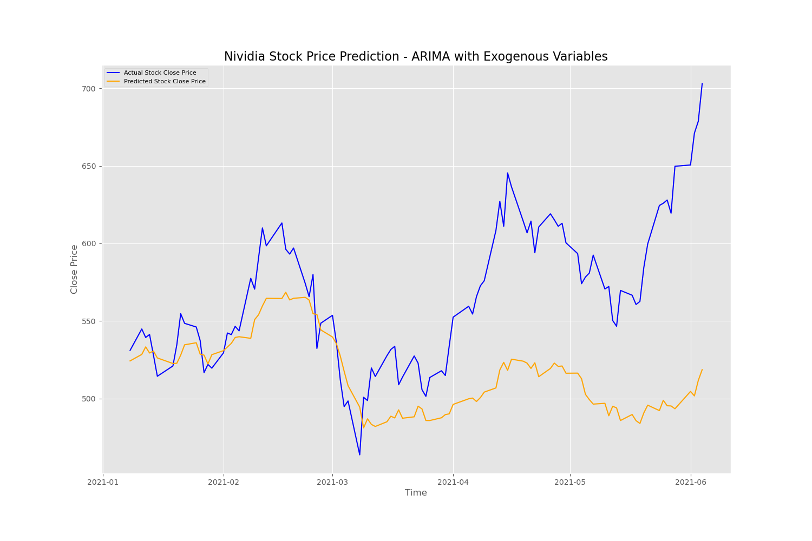

# Nvidia_Stock_Prediction
<br>
**Authors**: [Kibae Kim](mailto:rlqo7376@gmail.com)

Nvidia Corporation, an American multinational technology company designs graphics processing units (GPUs) for the gaming and professional markets, as well as system on a chip units (SoCs) for the mobile computing and automotive market. Its primary GPU line, labeled "GeForce", is in direct competition with the GPUs of the "Radeon" brand by Advanced Micro Devices (AMD)


## Business Problem
It is common in financial industry to use time series forecasting to track the price of a stock over time. This can be tracked in the short term, such as the price of a stock in one hour during a business day, or in the long term, such as the price of a stock on the last day of each month. Stock markets are very unpredictable and geopolitical changes can affect the stock trend of stocks in the stock market. Recently, we faced 2020 stock market crash, caused by Covid-19, that began on 20 February 2020 and ended on 7 April. Therefore, it is very difficult to perform reliable trend analysis on with previous time series forecasting.

2021 is called the year of cryptocurrency. Cryptocurrency is a digital currency that can be used to purchase goods and services, but it uses an online ledger with strong encryption to secure your online transactions. Much of the interest in these unregulated currencies is that speculators sometimes trade for profit to increase their prices. The popularity of cryptocurrency caused a shortage in the graphics card market. At the same time, it leads increasing of a graphics card supplier, Nvidia.

I want to build a reliable time series forecasting model that predict Nvidia stock price taking into account the cryptocurrency boom and the impact of the Covid-19. Therefore, this project aims to provide a updated time series forecasting for investment banks to predict better Nvidia future stock price.


## Overview
The data for the prediction was collected using [Yahoo Finance](https://finance.yahoo.com/) with support of pandas, numpy, and datetime library of Python. [Nvidia closing stock price](https://finance.yahoo.com/quote/NVDA/history?p=NVDA) is main dependent variable which predicted in this project, and [AMD previous day closing stock price](https://finance.yahoo.com/quote/AMD?p=AMD&.tsrc=fin-srch), [Google trend data](https://trends.google.com/trends/explore?q=nvidia&geo=US), [graphics card market share from Statista](https://www.statista.com/statistics/274005/market-share-of-global-graphics-card-shipments-since-3rd-quarter-2010/), and [Nvidia Earnings Date, Estimates & History from Market Beat](https://www.marketbeat.com/stocks/NASDAQ/NVDA/earnings/) were chosen for exogenous variables. For time series forecasting model, ARIMA, ARIMA with exogenous variables, LSTM, and Prophet were tested on daily closing price of Nvidia.


## Method
1. Nvidia's historical stock data was collected from Yahoo Finance between 1/22/1999 and 6/4/2021
2. Relationships between stock closing price and exogenous variables
3. ARIMA order for Nvidia's daily closing price were calculated
    - Auto ARIMA
4. ARIMA, ARIMA with exogenous variables built and tested
5. LSTM, Prophet will be built soon


## Data

### EDA
The collected Nvidia stock history data from Yahoo Finance is clean and did not have nan values. The data includes date, open, high, low, close, adj close, and volume, and I added revenue, future, and market share from Market Beat and Statista. For this project Nvidia closing price will be predicted.


### Nvidia Stock Price
<br>

#### Between 09/16/2018 and 06/01/2019
Concerns about rising interest rates, a slowing global economy and particularly slowing demand for semiconductors and the escalating trade war with China were likely the main reasons for the market jitters. NVIDIA stock declined. In addition, Nvidia's release of third-quarter results along with fourth-quarter guidance on 11/15/2018, that disappointed the market. The slope of the graph changed before and after the stock price plunged in this period. After the stock price plunged in this period, The slope of the stock price upward graph increased.

#### Between 02/20/2020 and 04/07/2020
The 2020 stock market crash was a major and sudden global stock market crash that began on 2/20/2020 and ended on 04/07/2020, and Nvidia's stock closing price also decreased in this period. However, the period was short, and the stock immediately recovered the previous share price.


### Relationship Betweeen Nvidia Closing Price and Exogenous Variables
<br>

I chose quarterly reported revenue of Nvidia, Nvidia graphics card's market share, previous AMD stock closing price, and Google trend as possible exogenous variables for ARIMA model. There are positive relationships between Nvidia closing stock price and exogenous variables.


### Stationality and Seasonality
<br>
<br>

The P-value of Nvidia stock closing price is 0.97, which is higher than 0.05, so it doesn't have stationarity. Also, it doesn't have seasonality neither according to decomposition  of Nvidia stock closing price.


## Model and Result
The model will be built with ARIMA (AutoRegressive Integrated Moving Average) model by using log value of Nvidia's closing stock price and will be tested on predicting from 2021 with Nvidia's closing stock price so far. The strategy is following:

1. Split data for forward propagation testing
    - predict Nvidia's closing stock price from 2021
<br>

2. Create ARIMA model
    - build ARIMA model with Nvidia's closing stock price history
3. Calculate best ARIMA order
    - Auto ARIMA
4. Compare each model performance
    - RMSE

### ARIMA
To prepare the ARIMA model for forecasting on our data few parameters must be calculated and analyzed. However, I used Auto ARIMA to get those parameters. According to Auto ARIMA result, ARIMA(2,1,0) is the best model for this forecasting.

#### Plot Diagnostics of ARIMA
<br>

1. Standardized residual: The residual errors seem to fluctuate around a mean of zero.

2. Histogram: The density plot suggests normal distribution with mean shifted towards right.

3. Theoretical Quantiles: Mostly the dots fall perfectly in line with the red line. Any significant deviations would imply the distribution is skewed.

4. Correlogram: The Correlogram, (or ACF plot) shows the residual errors are not autocorrelated. The ACF plot would imply that there is some pattern in the residual errors which are not explained in the model. So, I will need to look for more X’s (predictors) to the model.

Overall, the model seems to be a good fit. So, I use it to forecast.

#### Building ARIMA
Even though, Nvidia's stock closing price was in the 95% confidence interval, Prediction of ARIMA model order of (2, 1, 0) on Nvidia stock closing price was not closed to true value.

Overall, ARIMA of (2, 1, 0) performed best with:
 - RMSE: 0.13
 - %RMSE: 0.0203
 - Model assumed steady, but in reality the stock increased
 - decrease from most recent lag likely have large impact on prediction
<br>

### ARIMA with Exogenous Variables
To prepare the ARIMA with exogenous variables model for forecasting on our data few parameters must be calculated and analyzed. However, I used Auto ARIMA to get those parameters. According to Auto ARIMA result, ARIMA(3,1,0) is the best model for this forecasting.

#### Plot Diagnostics of ARIMA with Exogenous Variables
<br>

1. Standardized residual: The residual errors seem to fluctuate around a mean of zero.

2. Histogram: The density plot suggests normal distribution with mean shifted towards right.

3. Theoretical Quantiles: Mostly the dots fall perfectly in line with the red line. Any significant deviations would imply the distribution is skewed.

4. Correlogram: The Correlogram, (or ACF plot) shows the residual errors are not autocorrelated. The ACF plot would imply that there is some pattern in the residual errors which are not explained in the model. So, I will need to look for more X’s (predictors) to the model.

Overall, the model seems to be a good fit. So, I use it to forecast.

#### Building ARIMA with Exogenous Variables
Fitting ARIMA with exogenous variables model orders of (3, 1, 0) on Nvidia stock closing price resulted in much closer prediction in true value than ARIMA model.

Overall, ARIMA of (3, 1, 0) performed best with:
 - RMSE: 0.05
 - %RMSE: 0.0086
 - Model assumed steady, but in reality the stock increased
 - decrease from most recent lag likely have large impact on prediction
<br>


## Conclusion
Trading year 2020 had market movements, especially with COVID-19 crash but fortunately, its effect on Nvidia stock closing price was low and Nvidia recovered its stock closing price quickly. Overall, the prediction made in this project yielded good insights to market trend using ARIMA with exogenous variables to predict Nvidia future stock closing price. The project will help investment banks to predict Nvidia's future stock prices.


## Future Work
1. Test with LSTM and Prophet model
2. Find other exogenous variables


## Repository Structure

```
├──  data                                            # All the CSV files used for the notebook.
├── images                                           # All visualization and images of the project
├── Nvidia_Stock_Prediction.ipynb                    # Noteboooks used to build the project
├── COVID19_Detection_project_presentation.pdf       # PDF version of project presentation
├── README.md                                        # Top-level README
```
